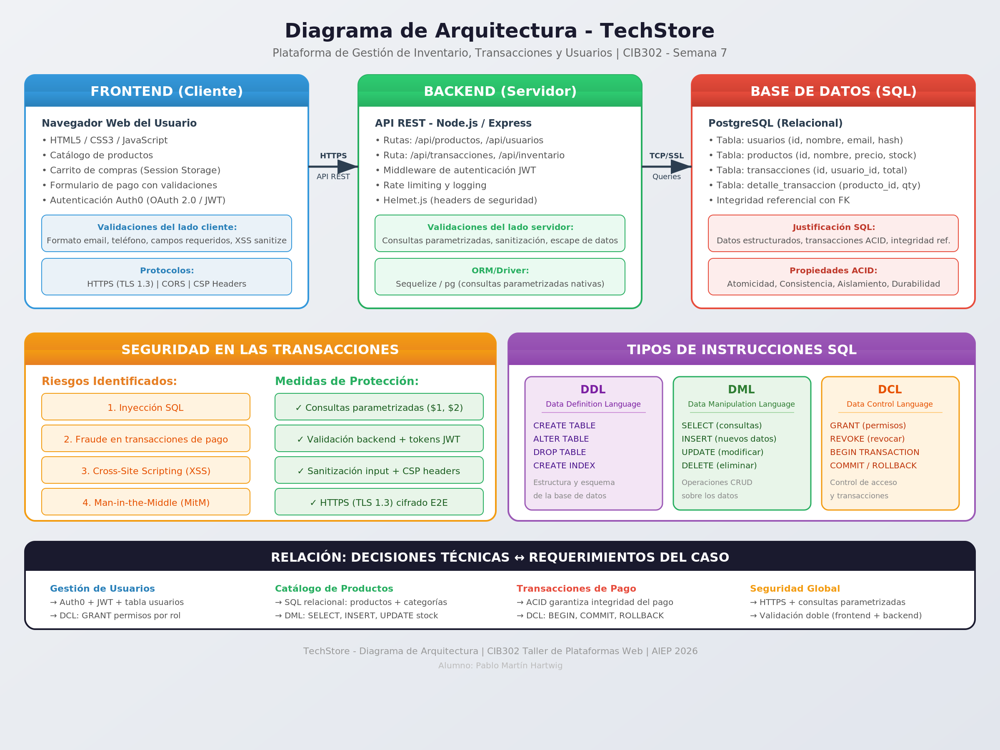

# TechStore - Diagrama de Arquitectura de Base de Datos

Actividad formativa Semana 7 - CIB302 Taller de Plataformas Web

## Elección de Base de Datos: SQL (PostgreSQL)

Se selecciona PostgreSQL por:
- **Datos estructurados**: usuarios, productos, transacciones con relaciones claras (FK)
- **Transacciones ACID**: atomicidad, consistencia, aislamiento y durabilidad para pagos
- **Integridad referencial**: restricciones que evitan inconsistencias en el inventario

## Riesgos de Seguridad en Transacciones

| Riesgo | Mitigación |
|--------|-----------|
| Inyección SQL | Consultas parametrizadas ($1, $2) |
| Fraude en pagos | Validación de precios en backend + transacciones ACID |
| XSS | Sanitización de inputs + headers CSP |
| Man-in-the-Middle | HTTPS con TLS 1.3 + conexión SSL a BD |

## Instrucciones SQL

- **DDL**: CREATE TABLE, ALTER TABLE, DROP TABLE, CREATE INDEX
- **DML**: SELECT, INSERT, UPDATE, DELETE
- **TML/DCL**: BEGIN, COMMIT, ROLLBACK, GRANT, REVOKE

## Diagrama de Arquitectura

## Autor

Pablo Martín Hartwig - AIEP 2026
